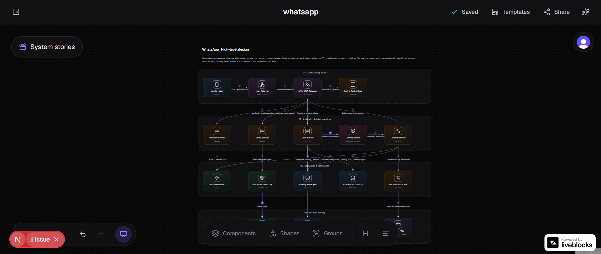

# Archflow

A collaborative workspace for designing and explaining software systems. Build architecture diagrams, explore animated flows, and turn your design into a technical specification.

[Live demo](https://archflow-mauve.vercel.app)



## Features

- Real-time collaboration with shared editing and live cursors.
- Infrastructure components, groups, headings, and text blocks.
- High-level templates with system diagrams and logical data models.
- System stories with animated flows and failure/recovery examples.
- AI-assisted architecture design and Markdown specification export.
- Project sharing, autosave, and undo/redo.

## Run locally

You need Node.js 22.12+ and PostgreSQL, plus credentials for Clerk, Liveblocks, Trigger.dev, OpenAI, and Vercel Blob.

1. Install dependencies:

   ```bash
   npm install
   ```

2. Copy `.env.example` to `.env` and fill in the credentials, database URL, and Trigger.dev project reference.

3. Set up the database and start the app:

   ```bash
   npm run db:migrate
   npm run dev
   ```

4. For AI design and specification generation, run the worker in a second terminal:

   ```bash
   npm run trigger:dev
   ```

Open [localhost:3000](http://localhost:3000) and sign in.

## Development

Built with Next.js, TypeScript, Tailwind CSS, React Flow, Liveblocks, Prisma, and Trigger.dev.

```bash
npm test
npm run lint
npm run build
```

## License

[MIT](LICENSE).
